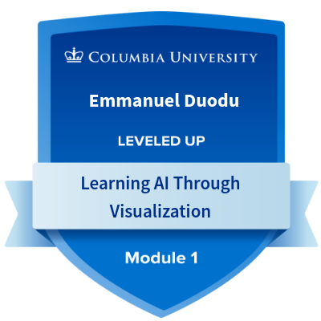
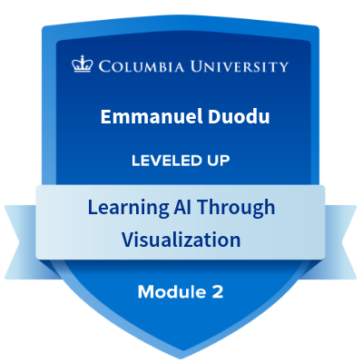
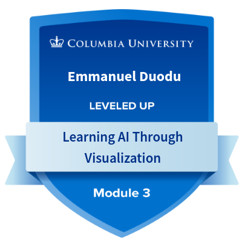
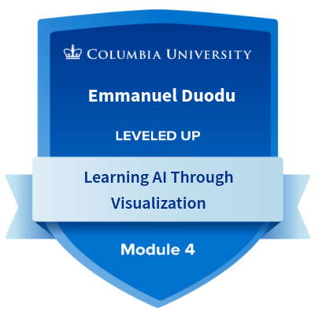
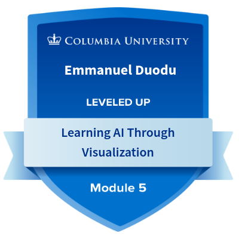

## Hi there 👋

## 👋 About Me
Strategic Data Engineer | AI & MLOps  Architect | Cloud Migration Lead  
Certified in AWS AI & ML, Columbia AI Visualization, and IBM SkillsBuild.  
Specialized in agentic automation, predictive analytics, and scalable freelance solutions for global clients.

## 🏆 Achievements
- Migrated 975PB+ data from Teradata to GCP BigQuery.
- Reduced decision latency by 30% with predictive dashboards.
- Selected for AWS AI & ML Scholars Challenge (2025).
- Engineered modular ETL automation using Python and CI/CD pipelines.
  
## 🏆Certifications

## 🔧 Tools & Skills
GCP | BigQuery | Python | SQL | LangChain | MLflow | Power BI | Data Lake | Data Mesh | CI/CD | KPI Dashboards | Data Governance
